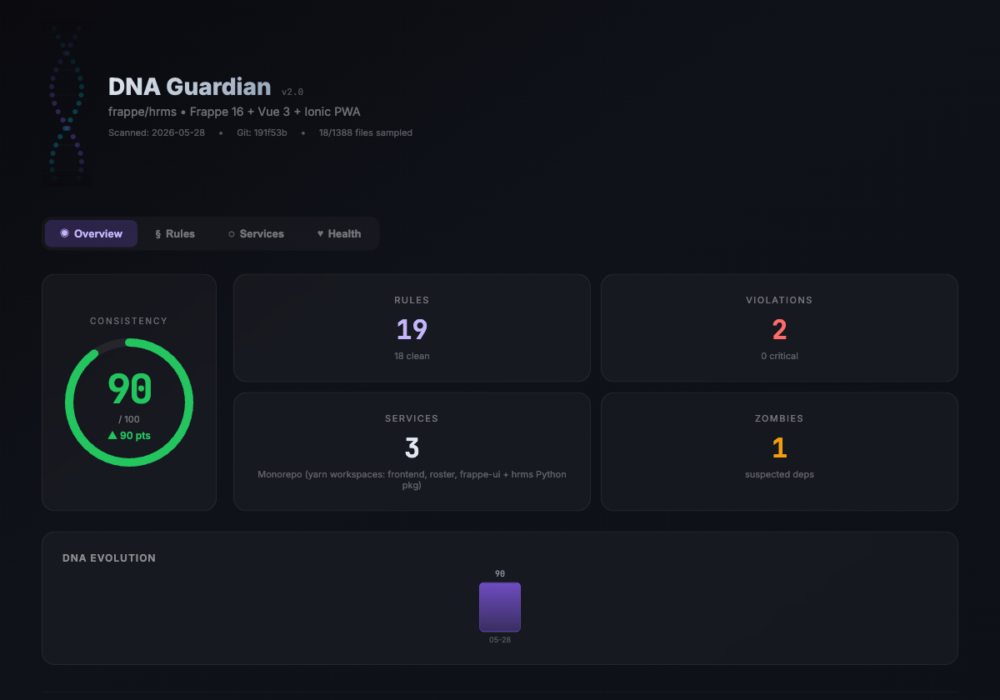
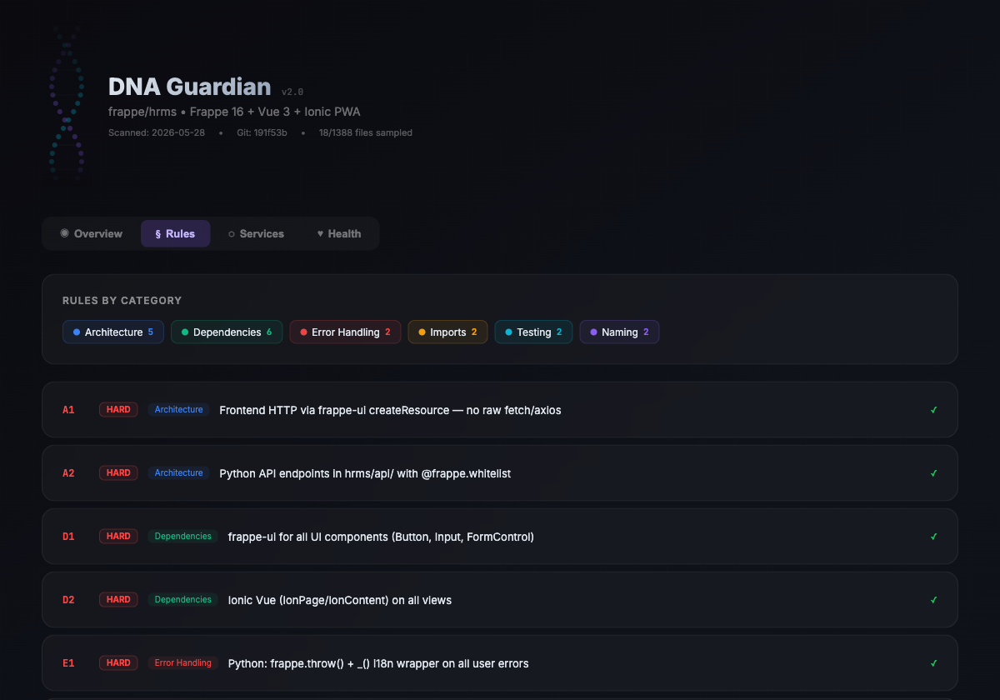
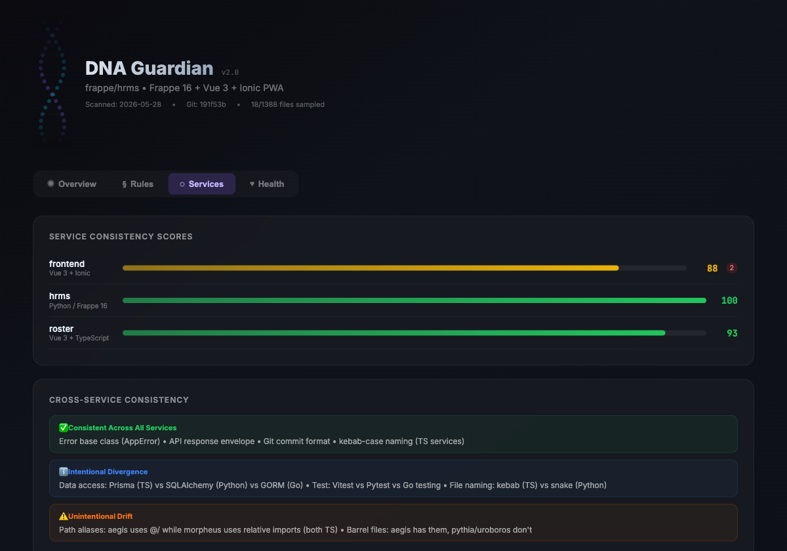
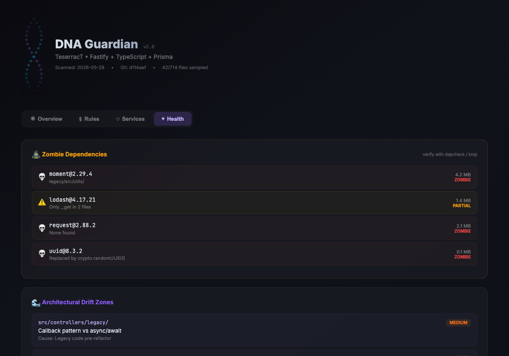

# 🧬 Codebase DNA Guardian

> A Claude Code skill that extracts and enforces a codebase's tribal knowledge.

[](https://www.npmjs.com/package/codebase-dna-guardian)
[](https://opensource.org/licenses/MIT)
[](https://claude.ai/claude-code)



<div align="center">

|  |  |
|:---:|:---:|
| **Rules Browser** — HARD/SOFT/PREF with violation locations | **Service Scores** — per-service consistency bars + cross-service drift |

|  | |
|:---:|:---:|
| **Health Tab** — zombie dependencies + architectural drift zones | |

</div>

---

Every mature codebase has unwritten rules — naming conventions, error handling patterns, import styles, architectural decisions — that only experienced team members know. New developers (and AI assistants) violate these rules not out of incompetence, but because **nobody wrote them down**.

DNA Guardian captures those rules as a machine-readable profile and enforces them continuously.

---

## ✨ What it does

| Command | Description |
|---------|-------------|
| `/dna-scan` | Scan the codebase and extract conventions as a DNA profile |
| `/dna-check [path]` | Audit files against the DNA profile |
| `/dna-refactor [path]` | Auto-fix convention violations |
| `/dna-report` | Generate a project-wide health dashboard |
| `/dna-preview` | Render an interactive HTML visual report |
| `/dna-onboard` | Generate a new-developer briefing from the DNA |
| `/dna-diff` | Show how conventions have evolved since last scan |
| `/dna-guard [branch]` | Pre-merge gate — block HARD violations |

---

## 🚀 Installation

### Via npm (Claude Code skill registry)

```bash
npm install -g codebase-dna-guardian
```

### Manual install

Clone this repo and add to your Claude Code skills directory:

```bash
git clone https://github.com/mturac/codebase-dna-guardian
# Then add to your Claude Code skills directory
```

---

## 📖 Quick Start

```
# 1. Scan your project
/dna-scan

# 2. Check a file before merging
/dna-check src/services/payment.ts

# 3. See the health dashboard
/dna-report

# 4. Visual interactive report
/dna-preview

# 5. Guard a PR
/dna-guard feature/payment-refactor
```

After running `/dna-scan`, Claude Code will **automatically consult the DNA before generating any new code** in your project — no extra commands needed.

---

## 🏗 How it works

### 1. Scan (15–20 files, not the whole codebase)

The scanner is surgical — it samples strategically:
- Config files (tsconfig, eslint, pyproject.toml, etc.)
- Entry points (main.ts, app.ts, server.py)
- One **vertical slice** of a typical feature (route → service → repository → test)
- Error handling samples
- Shared utilities
- Test files

From these ~20 files it extracts patterns across 8 categories: Naming, Architecture, Error Handling, Testing, Imports, Dependencies, API Contracts, Async Patterns.

### 2. Severity tiers

Every rule has one of three tiers:

| Tier | Behaviour |
|------|-----------|
| 🔴 **HARD** | Stop before generating violating code. Explain. Ask to confirm. |
| 🟡 **SOFT** | Generate compliant code + add a brief footnote. |
| 🟢 **PREF** | Silently apply. No mention. |

### 3. Passive Guardian Mode

Once a `.claude/dna.md` exists, Claude Code **reads it before every code generation** — you don't have to invoke the skill explicitly. The DNA is always active.

---

## 📁 DNA Profile Format

The scan writes to `.claude/dna.md` (single project) or `.claude/dna/` (monorepo):

```
.claude/
  dna/
    root.md          ← shared rules
    frontend.md      ← service-specific overrides
    backend.md       ← service-specific overrides
    cross-service.md ← auto-generated divergence map
  dna-history.md     ← audit trail of all changes
```

---

## 📊 Visual Dashboard

The `scripts/` directory contains a React dashboard component that renders an interactive health report:

```bash
cd scripts && npm install && npm run dev
```

Or use `/dna-preview` inside Claude Code — it will bundle and serve the dashboard automatically.

**Features:**
- Animated consistency score ring
- Per-service consistency bars
- Rules browser with violation locations
- Zombie dependency tracker
- Architectural drift zones
- DNA evolution sparkline

---

## 🧩 Monorepo Support

DNA Guardian handles multi-service projects natively:

```
Wave 1: Root scan (shared config, CI, shared utils)
Wave 2: Per-service scan (one vertical slice per service)
Wave 3: Cross-comparison (diff patterns across services)
Wave 4: Classification (intentional divergence vs drift)
```

Services are detected by workspace config (`pnpm-workspace.yaml`, `package.json workspaces`, `lerna.json`, `nx.json`, `turbo.json`) or by presence of multiple manifests at depth 2.

---

## 🔒 Severity Examples

### HARD — stops code generation
```
🧬 DNA-A2 (HARD): This project uses the Repository pattern — controllers
call services, services call repositories, repositories talk to the DB.
Direct DB access in a controller would break the architectural layering.

I'll create a repository method and wire it through the service layer instead.
```

### SOFT — footnote only
```
Note: Named as `payment-service.ts` following DNA-N1 (kebab-case file naming).
```

### PREF — silent
Uses `dayjs` instead of `moment` because DNA-D2 says so. No mention.

---

## 🌍 Other Languages

[🇹🇷 Türkçe](README.tr.md) · [🇫🇷 Français](README.fr.md) · [🇩🇪 Deutsch](README.de.md) · [🇨🇳 中文](README.zh.md) · [🇰🇷 한국어](README.ko.md)

---

## 🤝 Contributing

See [CONTRIBUTING.md](CONTRIBUTING.md). PRs welcome.

---

## 📜 License

MIT © Mehmet Turac
